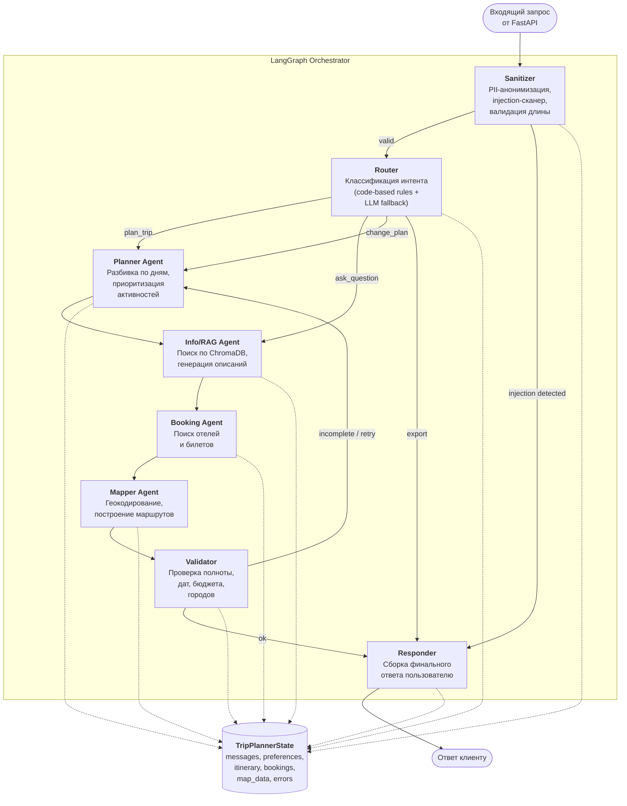
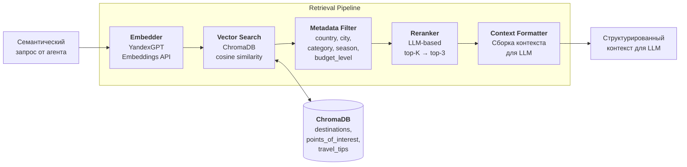
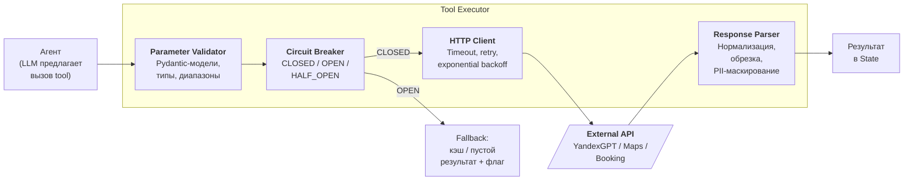

# C4 Component Diagram — Trip Planner AI

Внутреннее устройство ядра системы: компоненты LangGraph Orchestrator и Retrieval Pipeline.

## Orchestrator (LangGraph Graph)

## Retrieval Pipeline (Info/RAG Agent)

## Tool Execution Layer

## Компоненты и их обязанности

| Компонент | Слой | Обязанности | Входные данные | Выходные данные |
|:---|:---|:---|:---|:---|
| **Sanitizer** | Input Guard | PII-анонимизация, injection detection, лимит символов | Сырой текст пользователя | Очищенный текст или rejection |
| **Router** | Orchestration | Определение интента (plan_trip, change_plan, ask_question, export) | Очищенный запрос + history | intent + параметры маршрутизации |
| **Planner Agent** | Agent | Декомпозиция поездки на дни, расстановка активностей | UserPreferences, intent | list[DayPlan] |
| **Info/RAG Agent** | Agent | Семантический поиск + генерация описаний мест | Запрос + context из Planner | Описания, факты, рейтинги |
| **Booking Agent** | Agent | Поиск отелей и билетов через внешние API | Город, даты, бюджет | list[BookingOption] |
| **Mapper Agent** | Agent | Геокодирование точек, построение маршрута | list[DayPlan] с адресами | MapData (координаты, polylines) |
| **Validator** | Output Guard | Проверка полноты (все дни заполнены, даты валидны, бюджет не превышен) | Собранный черновик | ok / retry с описанием проблемы |
| **Responder** | Output | Сборка финального JSON, форматирование для UI | Все agent_outputs | Структурированный ответ |
| **Embedder** | Retrieval | Преобразование текстового запроса в вектор | Текст | float[384] |
| **Vector Search** | Retrieval | Поиск ближайших соседей в ChromaDB | Вектор + metadata filters | top-K документов |
| **Reranker** | Retrieval | Переранжирование по релевантности через LLM | top-K документов + запрос | top-3 документа |
| **Parameter Validator** | Tool Exec | Валидация типов и диапазонов параметров tool call | Raw args от LLM | Validated Pydantic model |
| **Circuit Breaker** | Tool Exec | Защита от каскадных сбоев | Запрос к API | Pass / fallback |
| **HTTP Client** | Tool Exec | Выполнение запроса с timeout и retry | Validated request | Raw response |
| **Response Parser** | Tool Exec | Нормализация, обрезка, PII-маскирование ответа | Raw API response | Cleaned result |
