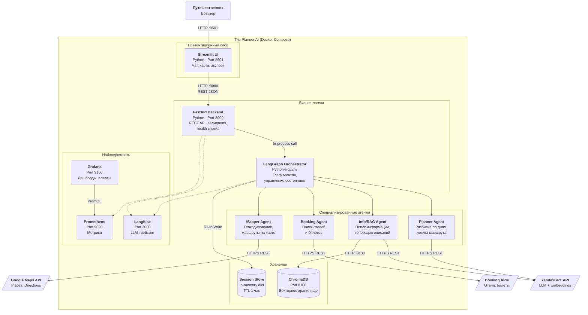
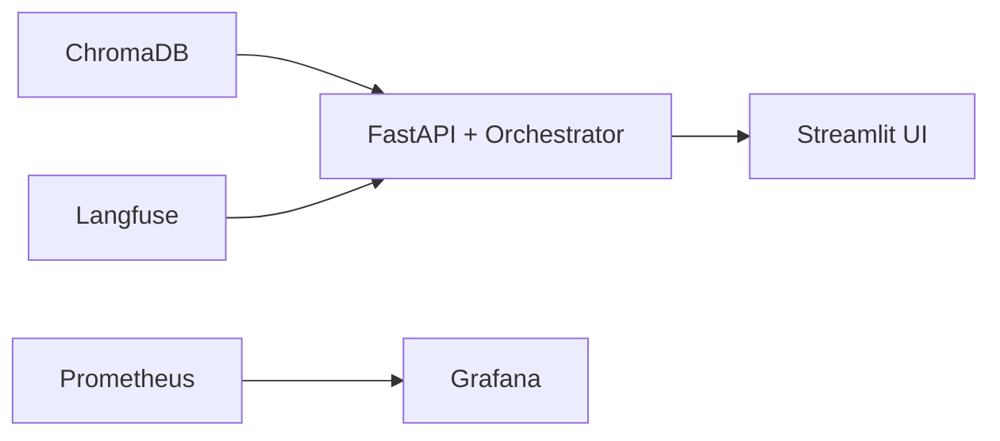

# C4 Container Diagram — Trip Planner AI

Внутренняя структура системы: контейнеры, хранилища, протоколы взаимодействия.

## Контейнеры и технологии

| Контейнер | Технология | Порт | Назначение | Ресурсы (PoC) |
|:---|:---|:---|:---|:---|
| **Streamlit UI** | Python / Streamlit | 8501 | Интерфейс пользователя: чат, интерактивная карта, кнопки действий, экспорт | 0.5 vCPU, 512 MB |
| **FastAPI Backend** | Python / FastAPI + Uvicorn | 8000 | HTTP API, входная валидация, PII-анонимизация, health checks, CORS | 0.5 vCPU, 512 MB |
| **LangGraph Orchestrator** | Python / LangGraph (in-process) | — | Граф агентов, маршрутизация по интентам, управление состоянием, retry/fallback | Работает внутри FastAPI |
| **ChromaDB** | ChromaDB (Docker) | 8100 | Векторное хранилище описаний мест, POI, визовых правил | 0.25 vCPU, 512 MB |
| **Session Store** | In-memory (Python dict) | — | Состояние сессии (TripPlannerState), TTL 1 час | Часть процесса FastAPI |
| **Langfuse** | Langfuse (Docker) | 3000 | Трейсинг LLM-вызовов, стоимость токенов, latency | 0.25 vCPU, 512 MB |
| **Prometheus** | Prometheus (Docker) | 9090 | Сбор метрик (request_duration, tool_errors, circuit_breaker_state) | 0.25 vCPU, 256 MB |
| **Grafana** | Grafana (Docker) | 3100 | Визуализация метрик, настройка алертов | 0.25 vCPU, 256 MB |

## Протоколы взаимодействия

| Источник | Назначение | Протокол | Формат данных |
|:---|:---|:---|:---|
| Streamlit → FastAPI | HTTP | REST | JSON |
| FastAPI → Orchestrator | In-process | Python call | TypedDict (TripPlannerState) |
| Agents → YandexGPT | HTTPS | REST | JSON (OpenAI-compatible) |
| Info/RAG → ChromaDB | HTTP | REST / gRPC | Embedding vector + metadata filters |
| Booking Agent → Booking APIs | HTTPS | REST | JSON |
| Mapper Agent → Maps API | HTTPS | REST | JSON |
| FastAPI → Langfuse | HTTPS | REST | Trace / Span / Generation |
| Prometheus → FastAPI | HTTP | Scrape /metrics | Prometheus text format |
| Grafana → Prometheus | HTTP | PromQL | Time series |

## Зависимости при запуске

Порядок запуска в Docker Compose: ChromaDB и Langfuse запускаются первыми (`depends_on` с health check), затем FastAPI, затем Streamlit. Prometheus и Grafana запускаются параллельно.
