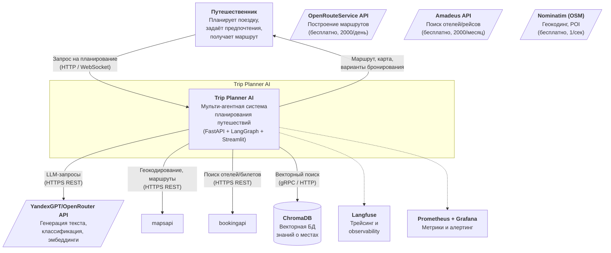
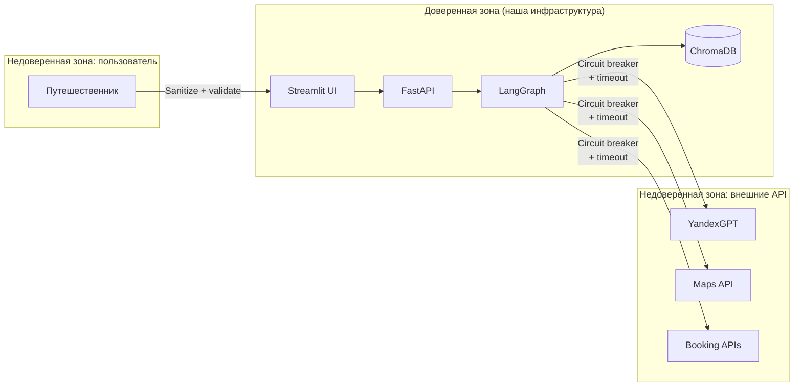

# C4 Context Diagram — Trip Planner AI

Система, пользователь, внешние сервисы и границы доверия.

## Описание границ

| Граница | Внутри | Снаружи |
|:---|:---|:---|
| **Trip Planner AI** | Streamlit UI, FastAPI Backend, LangGraph Orchestrator, агенты (Planner, Info/RAG, Booking, Mapper), Session State, ChromaDB | — |
| **Внешние LLM** | — | YandexGPT/OpenRouter API (генерация, эмбеддинги) |
| **Внешние Data APIs** | — | OpenRouteService (маршруты), Amadeus (отели/рейсы), Nominatim (геокодинг) |
| **Observability** | — | Langfuse (трейсинг), Prometheus + Grafana (метрики, алерты) |

## Потоки данных на уровне контекста

| Поток | Направление | Протокол | Данные |
|:---|:---|:---|:---|
| Пользователь → Система | Входящий | HTTP / WebSocket | Текстовый запрос (город, даты, интересы, бюджет) |
| Система → Пользователь | Исходящий | HTTP / WebSocket | Маршрут (JSON + карта), варианты бронирования, PDF/ICS |
| Система → YandexGPT | Исходящий | HTTPS REST | Промпт + контекст (до 4000 токенов) |
| YandexGPT → Система | Входящий | HTTPS REST | Структурированный ответ (JSON) |
| Система → Maps API | Исходящий | HTTPS REST | Координаты, waypoints, режим транспорта |
| Maps API → Система | Входящий | HTTPS REST | Маршрут (polyline), расстояния, время |
| Система → Booking APIs | Исходящий | HTTPS REST | Параметры поиска (город, даты, бюджет) |
| Booking APIs → Система | Входящий | HTTPS REST | Список отелей/билетов (JSON) |
| Система → ChromaDB | Двусторонний | gRPC / HTTP | Запрос эмбеддинга → топ-K документов |

## Границы доверия

Пользовательский ввод проходит через анонимизацию PII и injection-сканер перед попаданием в оркестратор. Все внешние API защищены circuit breaker, timeout и retry-политиками. Ответы внешних API валидируются перед использованием.
