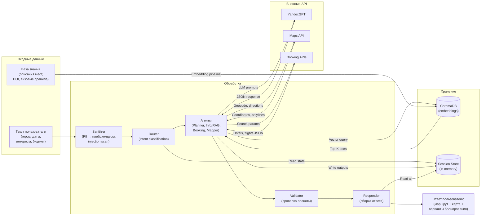
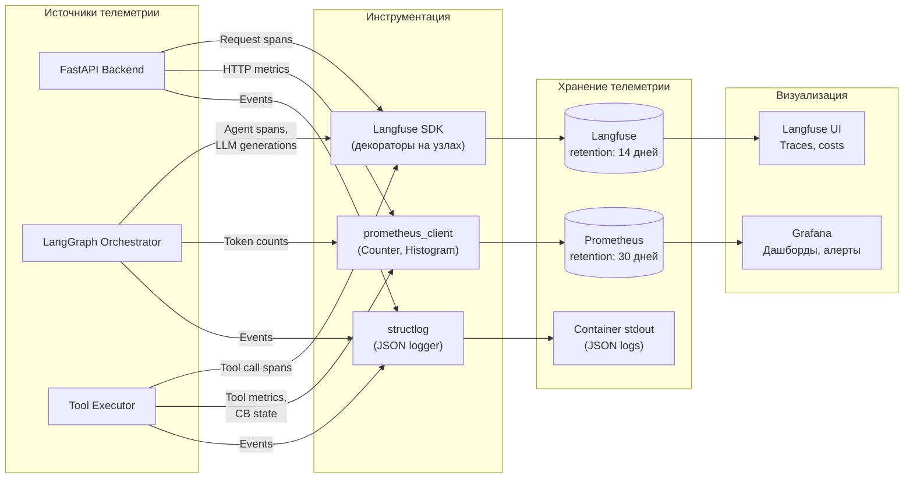
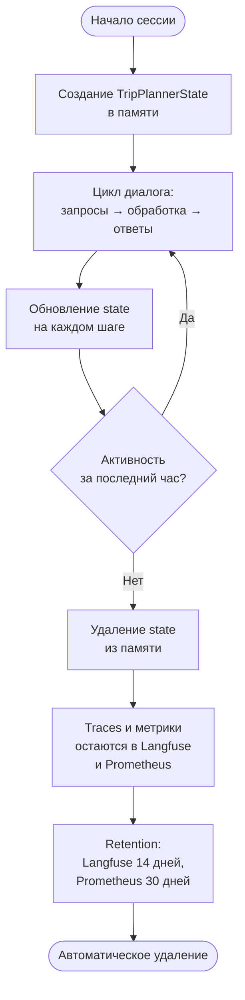
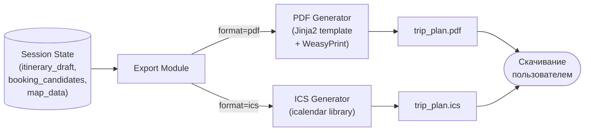

# Data Flow Diagram — Trip Planner AI

Как данные проходят через систему: что передаётся, что хранится, что логируется, что маскируется.

## Основной data path (запрос → обработка → ответ)

## Observability data path (метрики, логи, трейсы)

## Классификация данных

### Что передаётся (транзитно, не хранится)

| Данные | Откуда | Куда | Формат |
|:---|:---|:---|:---|
| Текст запроса пользователя (после анонимизации) | Streamlit → FastAPI | Orchestrator → Agents | str (очищенный) |
| LLM prompt (system + context + messages) | Agent | YandexGPT API | JSON (OpenAI-compatible) |
| LLM response | YandexGPT API | Agent | JSON (structured output) |
| Параметры поиска отелей/билетов | Booking Agent | Booking APIs | JSON |
| Результаты бронирования | Booking APIs | Booking Agent → State | JSON (нормализованный) |
| Координаты и маршруты | Maps API | Mapper Agent → State | JSON (GeoJSON) |
| Документы из RAG | ChromaDB | Info/RAG Agent → LLM context | text + metadata |

### Что хранится (persistent / semi-persistent)

| Данные | Где | Retention | Формат |
|:---|:---|:---|:---|
| Эмбеддинги описаний мест | ChromaDB | Постоянно | Vectors float[384] + metadata JSON |
| Состояние сессии (TripPlannerState) | In-memory dict | TTL 1 час (по неактивности) | Python TypedDict |
| LLM traces (prompts, completions, tokens, cost) | Langfuse | 14 дней | Spans + generations |
| Time-series метрики | Prometheus | 30 дней | TSDB |
| Структурированные логи | Container stdout | До ротации контейнера | JSON lines |

### Что маскируется (PII Policy)

| Данные | Действие | Где применяется |
|:---|:---|:---|
| Имена пользователей | Замена на `[PERSON]` | Sanitizer (вход), логи |
| Телефоны, email | Замена на `[PHONE]`, `[EMAIL]` | Sanitizer (вход), логи |
| Точные координаты пользователя | Замена на название района | Логи, Langfuse traces |
| Паспортные данные | Не принимаются, не обрабатываются | — |
| Платёжные данные | Не принимаются (no payments in PoC) | — |
| Сырой текст пользователя (до анонимизации) | **Не логируется** | — |

## Жизненный цикл данных одной сессии

## Поток данных при экспорте

Экспорт — полностью детерминированный процесс без вызова LLM. Данные берутся из текущего состояния сессии и форматируются по шаблону.
