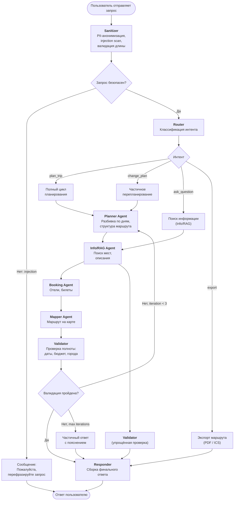
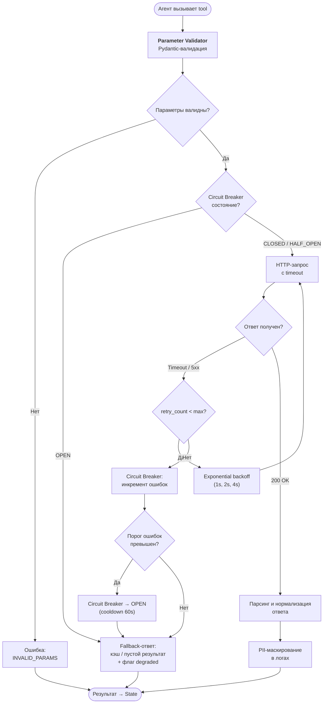
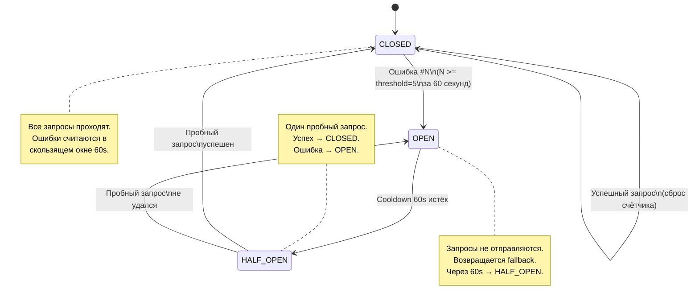
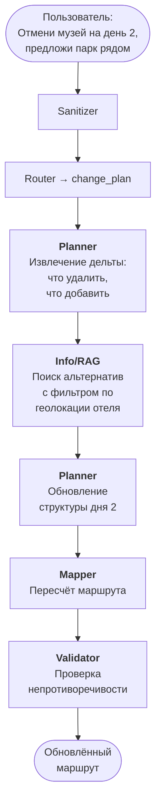
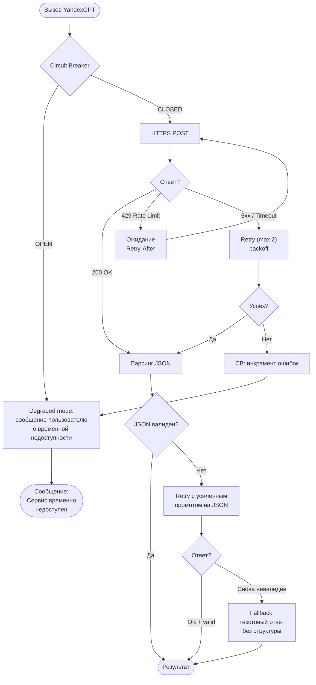

# Workflow Diagram — Trip Planner AI

Пошаговое выполнение запроса, включая ветки ошибок и механизмы отказоустойчивости.

## Основной workflow (Happy Path)

## Workflow вызова внешнего API (Tool Call)

Применяется к каждому вызову: YandexGPT, Maps API, Booking APIs.

## Circuit Breaker — State Machine

## Перепланирование маршрута (Change Plan)

## Обработка недоступности YandexGPT

## Сводка stop conditions

| Условие | Порог | Действие |
|:---|:---|:---|
| Итерации Validator → Planner | max 3 | Возврат частичного результата с пояснением |
| Retry на tool call | max 2 (с backoff) | Переход к fallback |
| Circuit Breaker errors | 5 ошибок за 60s | OPEN → fallback на 60s |
| Токены за сессию | лимит 50 000 | Предупреждение + завершение без новых LLM-вызовов |
| Время обработки запроса | 30s | Таймаут → частичный ответ с тем, что уже готово |
