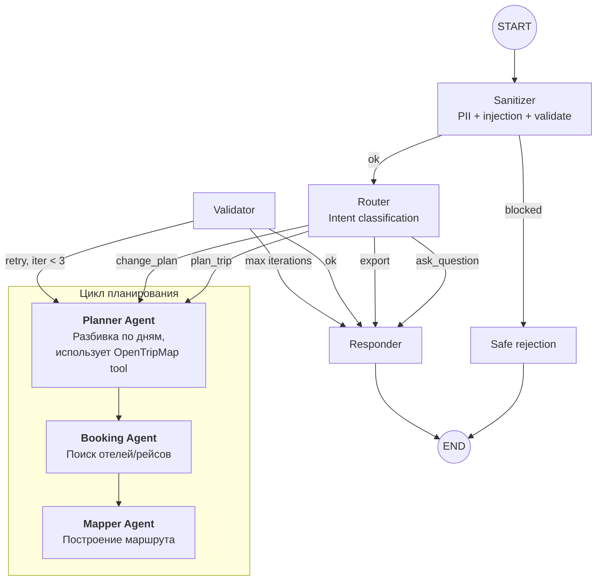
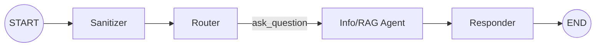

# Спецификация модуля: Agent / Orchestrator (LangGraph)

## 1. Назначение

Оркестратор — центральный управляющий компонент Trip Planner AI, реализованный на базе **LangGraph**. Координирует работу специализированных агентов, управляет состоянием сессии, обеспечивает маршрутизацию по интентам и контролирует качество выходных данных через цикл валидации.

Ключевой принцип: **переходы между узлами контролируются кодом, а не LLM**. Это обеспечивает предсказуемость, защиту от injection и детерминированное поведение при ошибках.

---

## 2. Архитектура графа

### Визуальная структура



### Граф для `ask_question`



Для вопросов о местах — укороченный pipeline без Planner, Booking и Mapper.

---

## 3. Схема состояния

Состояние — единый источник истины для всех узлов.

```python
from typing import Annotated, TypedDict
from langchain_core.messages import BaseMessage
from langgraph.graph.message import add_messages

class TripPlannerState(TypedDict):
    # Диалог
    messages: Annotated[list[BaseMessage], add_messages]
    session_id: str

    # Маршрутизация
    current_intent: str           # plan_trip | change_plan | ask_question | export
    is_blocked: bool              # True если injection detected

    # Пользователь
    user_preferences: UserPreferences

    # Результаты агентов
    itinerary_draft: list[DayPlan]
    booking_candidates: list[BookingOption]
    map_data: MapData | None
    agent_outputs: dict[str, Any]

    # Контроль выполнения
    iteration_count: int          # Счётчик retry (Validator → Planner)
    error_context: list[str]      # Накопленные ошибки

    # Флаги degradation
    retrieval_degraded: bool      # ChromaDB недоступен
    llm_degraded: bool            # YandexGPT circuit breaker OPEN
    booking_degraded: bool        # Booking APIs circuit breaker OPEN
    maps_degraded: bool           # Maps API circuit breaker OPEN
```

### Reducers

| Поле | Reducer | Описание |
|:---|:---|:---|
| `messages` | `add_messages` | Append-only, автоматическая дедупликация по ID |
| `error_context` | `operator.add` | Append-only, все ошибки накапливаются |
| Остальные поля | Last-write-wins | Каждый узел перезаписывает своё поле |

---

## 4. Описание узлов

### 4.1 Sanitizer

**Вход**: `messages[-1]` (последнее сообщение пользователя)

**Логика**:
1. PII-анонимизация: regex-замена имён → `[PERSON]`, телефонов → `[PHONE]`, email → `[EMAIL]`
2. Injection scanner: поиск паттернов "ignore previous", "you are now", "system prompt" и т.д.
3. Валидация: длина ≤ 2000 символов, непустой текст

**Выход**: `is_blocked=True` → rejection | очищенный `messages[-1]`

**Retry**: Нет (детерминированный код, не вызывает LLM)

---

### 4.2 Router

**Вход**: `messages` (последние 3), `user_preferences` (если уже есть)

**Логика**:
1. Rule-based классификация (приоритет):
   - Если `user_preferences` пусто и текст содержит город/дату → `plan_trip`
   - Если текст содержит "измени", "замени", "отмени" → `change_plan`
   - Если текст содержит "экспорт", "PDF", "календарь" → `export`
2. Если rule-based не сработал → LLM-классификация (YandexGPT, structured output)

**Выход**: `current_intent`

**Retry**: LLM-вызов — 1 retry при timeout | **Fallback**: `ask_question` (самый безопасный default)

---

### 4.3 Planner Agent

**Вход**: `user_preferences`, `current_intent`, `itinerary_draft` (для change_plan)

**Логика**:
- `plan_trip`: Генерация структуры маршрута по дням через LLM. Промпт включает предпочтения, количество дней, бюджет, состав группы.
- `change_plan`: Извлечение дельты из запроса, модификация существующего `itinerary_draft`.

**Выход**: `itinerary_draft` (list[DayPlan])

**Промпт** (упрощённо):

```
Ты — планировщик путешествий. Создай маршрут по дням.
Город: {city}. Даты: {start_date} — {end_date}.
Путешественники: {travelers}. Бюджет: {budget}.
Интересы: {interests}. Ограничения: {constraints}.
Верни JSON: [{day_number, date, activities: [{name, category, start_time, duration_minutes}]}]
```

**Retry**: 2x при невалидном JSON | **Fallback**: Текстовый ответ без структуры

---

### 4.4 Info/RAG Agent

**Вход**: `itinerary_draft`, `user_preferences.interests`

**Логика**:
1. Для каждой активности в `itinerary_draft` — вызов retriever (`search_places`)
2. Обогащение описаниями, координатами, часами работы, стоимостью
3. Если retriever degraded — генерация описаний из знаний LLM с пометкой `source: "llm_generated"`

**Выход**: Обогащённый `itinerary_draft`, флаг `retrieval_degraded`

**Retry**: 1x на retriever | **Fallback**: LLM-генерация без RAG

---

### 4.5 Booking Agent

**Вход**: `user_preferences` (город, даты, бюджет), `itinerary_draft`

**Логика**:
1. Вызов `search_hotels` с параметрами из preferences
2. Опционально: `search_flights` если в предпочтениях указан перелёт
3. Сортировка результатов по релевантности (цена, рейтинг, расстояние от маршрута)

**Выход**: `booking_candidates`

**Retry**: Через circuit breaker на tool level | **Fallback**: Рекомендации из RAG без актуальных цен

---

### 4.6 Mapper Agent

**Вход**: `itinerary_draft` (координаты), `user_preferences.city`

**Логика**:
1. Группировка активностей по дням
2. Вызов `build_route` для каждого дня (waypoints = координаты активностей)
3. Формирование `MapData` с polylines и map_url

**Выход**: `map_data`

**Retry**: Через circuit breaker на tool level | **Fallback**: Текстовое описание маршрута без карты

---

### 4.7 Validator

**Вход**: `itinerary_draft`, `booking_candidates`, `user_preferences`

**Логика** (детерминированный код, без LLM):
1. Все дни заполнены (нет пустых DayPlan)
2. Даты последовательны и соответствуют start_date/end_date
3. Суммарная стоимость ≤ budget (если указан)
4. Города в маршруте непротиворечивы
5. Нет дублирующихся активностей

**Выход**: `ok` → Responder | `retry` + описание проблем в `error_context`

**Retry**: Нет (вызывает повторное планирование)

---

### 4.8 Responder

**Вход**: Всё из State

**Логика**:
1. Сборка финального ответа: маршрут + описания + бронирование + карта
2. Если есть degradation-флаги — добавление предупреждений
3. Если есть `error_context` — добавление пояснений

**Выход**: `messages` (финальный ответ пользователю)

---

## 5. Conditional Edges

```python
def route_after_sanitizer(state: TripPlannerState) -> str:
    if state["is_blocked"]:
        return "reject_response"
    return "router"

def route_after_router(state: TripPlannerState) -> str:
    intent = state["current_intent"]
    if intent in ("plan_trip", "change_plan"):
        return "planner"
    elif intent == "ask_question":
        return "info_rag"
    elif intent == "export":
        return "responder"
    return "info_rag"  # safe default

def route_after_validator(state: TripPlannerState) -> str:
    if not state["error_context"] or state["error_context"] == []:
        return "responder"
    if state["iteration_count"] < 3:
        return "planner"  # retry
    return "responder"    # max iterations, return partial
```

---

## 6. Stop Conditions

| Условие | Порог | Действие |
|:---|:---|:---|
| Итерации Validator → Planner | max 3 | Responder с partial result + explanation |
| Общий таймаут запроса | 30 секунд | Прерывание, отдача текущего State |
| Токены за сессию | 50 000 | Предупреждение + отказ от новых LLM-вызовов |
| Все внешние API недоступны | CB OPEN на всех | Текстовый ответ из знаний LLM |
| LLM полностью недоступен | 3 ошибки подряд | Rule-based routing + "сервис временно недоступен" |

---

## 7. Политики отказоустойчивости

| Узел | Retry | Fallback |
|:---|:---|:---|
| **Sanitizer** | Нет (детерминированный) | — |
| **Router** | 1x (LLM-вызов) | Rule-based routing → `ask_question` как default |
| **Planner** | 2x (невалидный JSON) | Текстовый маршрут без структуры |
| **Info/RAG** | 1x (retriever) | Генерация из знаний LLM |
| **Booking** | Через CB на tools | Список из RAG без цен |
| **Mapper** | Через CB на tools | Текстовое описание без карты |
| **Validator** | Нет | → Planner (retry) или partial response |
| **Responder** | Нет (детерминированный) | — |

---

## 8. Экономика

### Оценка стоимости (YandexGPT)

| Сценарий | Вызовов LLM | Токенов | Стоимость |
|:---|:---|:---|:---|
| Простой маршрут (3 дня) | 6-8 | ~15 000 | ~$0.04 |
| Сложный маршрут (7 дней) + retry | 10-14 | ~25 000 | ~$0.07 |
| Изменение плана | 4-5 | ~8 000 | ~$0.02 |
| Вопрос о месте | 2-3 | ~4 000 | ~$0.01 |
| Полная сессия (план + 2 изменения + 1 вопрос) | 18-25 | ~40 000 | ~$0.10 |

### Лимиты

- **Бюджет на сессию**: $0.10 (soft limit, предупреждение при >80%)
- **Таймаут на запрос**: 30 секунд
- **Max iteration_count**: 3

---

## 9. Мониторинг

### Langfuse Trace Structure

```
Trace (session_id)
├── Span: sanitizer (duration, is_blocked)
├── Span: router (duration, intent, model)
│   └── Generation: intent_classification (tokens, cost)
├── Span: planner (duration, days_count)
│   └── Generation: plan_generation (tokens, cost)
├── Span: info_rag (duration, retrieval_count, degraded)
│   └── Generation: description_generation (tokens, cost)
├── Span: booking (duration, candidates_count, degraded)
├── Span: mapper (duration, routes_count, degraded)
├── Span: validator (duration, passed, errors)
└── Span: responder (duration, response_length)
```

### Ключевые метрики

| Метрика | Тип | Описание |
|:---|:---|:---|
| `orchestrator_request_total` | Counter | Общее количество запросов по intent |
| `orchestrator_request_duration_seconds` | Histogram | Время полного цикла обработки |
| `orchestrator_iterations_total` | Histogram | Количество итераций Validator → Planner |
| `orchestrator_degraded_responses_total` | Counter | Ответы с флагами degradation |
| `orchestrator_partial_responses_total` | Counter | Ответы, не прошедшие полный pipeline |
