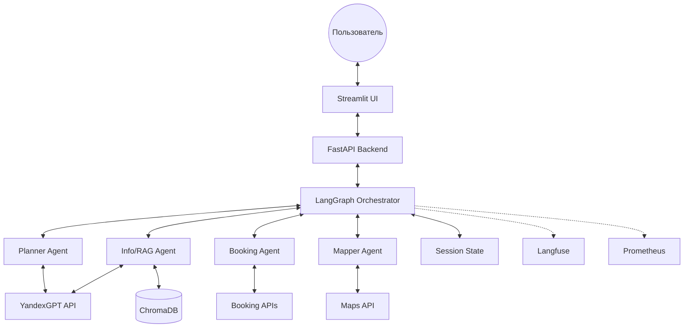

# System Design: Trip Planner AI

## 1. Обзор системы

**Trip Planner AI** — мульти-агентная система на базе LangGraph, которая по запросу пользователя генерирует персонализированный маршрут путешествия с привязкой к карте, подбирает опции размещения и позволяет экспортировать результат в PDF или календарь.

### Ключевые показатели

| Категория | Метрика | Целевое значение |
|:---|:---|:---|
| Производительность | p95 latency ответа агента | ≤ 10 секунд |
| Стоимость | Стоимость одной сессии | ≤ $0.10 |
| Качество | Точность классификации интентов | ≥ 90% |
| Качество | Галлюцинации в описаниях | < 5% |
| Надёжность | Успешность tool calls | ≥ 85% |

---

## 2. Архитектурные решения (ADR)

| Решение | Обоснование | Статус |
|:---|:---|:---|
| **LangGraph для оркестрации** | Детерминированные переходы между узлами графа (код, а не LLM), встроенное управление состоянием через TypedDict, поддержка циклов и условных ветвлений. Переходы контролируются программно — защита от prompt injection на уровне управления потоком. | Принято |
| **YandexGPT как основная LLM** | Доступность API в России, приемлемое качество для задач планирования и генерации текста, русскоязычные промпты без потери качества. Circuit breaker + fallback на кэшированные ответы при недоступности. | Принято |
| **ChromaDB для векторного поиска** | Легковесная встраиваемая vector DB, подходит для PoC-масштаба (тысячи документов), простая интеграция с Python, поддержка metadata-фильтрации. | Принято |
| **Бесплатные API (OpenRouteService, Amadeus, Nominatim)** | OpenRouteService для маршрутов (2000/день), Amadeus для отелей/рейсов (2000/месяц), Nominatim для геокодинга (1/сек). Бесплатные tier sufficient для PoC. | Принято |
| **FastAPI + Streamlit** | FastAPI — асинхронный бэкенд с автоматической документацией OpenAPI, health-check эндпоинты. Streamlit — быстрое прототипирование интерактивного UI с картой. Разделение frontend/backend позволяет независимо масштабировать. | Принято |
| **In-memory session state с TTL** | PoC не требует персистентности между перезапусками. LangGraph MemorySaver хранит состояние графа в памяти. TTL 1 час по неактивности — ограничение потребления RAM. | Принято |
| **Структурированный вывод LLM (JSON)** | Все ответы агентов форматируются как JSON-объекты с валидацией через Pydantic. Снижает риск инъекций и упрощает детерминированную обработку результатов. | Принято |
| **Circuit breaker на внешних API** | Каждая интеграция (YandexGPT/OpenRouter, OpenRouteService, Amadeus) защищена circuit breaker с порогами 5 ошибок / 60 секунд. Предотвращает каскадные отказы и экономит ресурсы при массовых сбоях. | Принято |

---

## 3. Архитектура системы

### Компоненты



### Обязанности модулей

| Модуль | Технология | Обязанности |
|:---|:---|:---|
| **Web UI** | Streamlit | Приём запросов, отображение маршрута на карте (st.map с OpenStreetMap), кнопки действий, экспорт |
| **API Backend** | FastAPI | HTTP-эндпоинты, аутентификация сессий, health checks, валидация входных данных |
| **Orchestrator** | LangGraph | Управление графом агентов, хранение состояния, маршрутизация по интентам, контроль итераций |
| **Planner Agent** | YandexGPT + OpenTripMap tool | Разбивка поездки на дни, логика маршрута, приоритизация активностей на основе реальных POI из OpenTripMap |
| **Booking Agent** | HTTP-клиент | Поиск отелей и билетов через внешние API, парсинг и нормализация результатов |
| **Mapper Agent** | Maps API клиент | Геокодирование, построение маршрутов, отображение точек на карте |
| **Session State** | In-memory (dict) | Хранение контекста сессии: предпочтения, черновик маршрута, история диалога |
| **ChromaDB** | ChromaDB | Векторное хранилище описаний мест, POI, визовых правил |
| **Observability** | Langfuse + Prometheus | Трейсинг, метрики, стоимость токенов, алертинг |

---

## 4. Основной Workflow

### Штатный сценарий

```
1. [Пользователь] Вводит запрос в Streamlit UI
2. [FastAPI] Валидация → PII-анонимизация → передача в Orchestrator
3. [Orchestrator / Sanitizer] Проверка на injection-паттерны, нормализация
4. [Orchestrator / Router] Классификация интента (plan_trip / change_plan / ask_question / export)
5. [Router → Agents] Делегирование специализированным агентам:
   - plan_trip → Planner (uses OpenTripMap tool) → Booking → Mapper (последовательно)
   - change_plan → Planner (перепланирование дельты с OpenTripMap)
   - ask_question → Responder (Info/RAG handled by Planner tools)
   - export → Export (детерминированный код)
6. [Agents] Вызов LLM и/или tools, формирование структурированного ответа
7. [Orchestrator / Validator] Проверка полноты и корректности (даты, бюджет, города)
8. [Orchestrator / Responder] Сборка финального ответа, отправка в UI
9. [Observability] Запись trace, метрик, логов на каждом шаге
```

### Перепланирование (Change Plan)

```
1. Пользователь: "Отмени музей на день 2, предложи что-то рядом с отелем"
2. Router → intent: change_plan
3. Planner: извлекает дельту, вызывает OpenTripMap для альтернатив, модифицирует структуру дня 2
4. Mapper: обновление маршрута на карте
5. Validator: проверка непротиворечивости маршрута
```

---

## 5. Управление состоянием

Система использует `TripPlannerState` для передачи данных между узлами LangGraph:

```python
class TripPlannerState(TypedDict):
    messages: Annotated[list[BaseMessage], add_messages]
    session_id: str
    user_preferences: UserPreferences    # город, даты, бюджет, интересы, состав группы
    current_intent: str                  # plan_trip | change_plan | ask_question | export
    itinerary_draft: list[DayPlan]       # структурированный маршрут по дням
    booking_candidates: list[BookingOption]
    map_data: MapData                    # координаты, маршруты, POI
    agent_outputs: dict[str, Any]        # промежуточные результаты агентов
    iteration_count: int                 # счётчик итераций (stop condition)
    error_context: list[str]             # накопленные ошибки для graceful degradation
```

### Политика контекстного окна

- **Бюджет на вызов LLM**: ~4000 токенов (system prompt + state summary + last N messages + tool results)
- **Приоритет**: system prompt > текущий черновик маршрута > последние 3 сообщения > результаты tools
- **Обрезка**: при превышении бюджета — старые сообщения удаляются первыми, маршрут остаётся всегда

---

## 6. Архитектура поиска (Retrieval)

### Коллекции ChromaDB

| Коллекция | Назначение | Кол-во документов (PoC) |
|:---|:---|:---|
| `destinations` | Описания городов и регионов | ~500 |
| `points_of_interest` | Достопримечательности, рестораны, парки | ~5000 |
| `travel_tips` | Визовые правила, советы, сезонность | ~300 |

### Стратегия поиска

1. **Dense retrieval**: Эмбеддинги через YandexGPT Embeddings API, cosine similarity
2. **Metadata-фильтры**: country, city, category (museum/restaurant/park), season, budget_level
3. **Top-K**: 10 результатов → опциональный LLM-based reranking до top-3

### Fallback

При недоступности ChromaDB — возврат пустого результата с флагом `retrieval_degraded` в состоянии, агент переключается на генерацию на основе внутренних знаний LLM с пометкой пользователю.

---

## 7. Интеграции с внешними API (Tools)

| Tool | Назначение | Тип | Timeout | Retry | Circuit Breaker |
|:---|:---|:---|:---|:---|:---|
| `search_flights` | Поиск авиабилетов | Read | 5s | 2x, backoff | 5 err / 60s |
| `search_hotels` | Поиск отелей | Read | 5s | 2x, backoff | 5 err / 60s |
| `get_poi_info` | Информация о местах (RAG) | Read | 2s | 1x | — |
| `build_route` | Построение маршрута на карте | Read | 3s | 2x, backoff | 5 err / 60s |
| `export_itinerary` | Экспорт в PDF/ICS | Write | 10s | 0 | — |

Все tools реализованы как строго типизированные функции с Pydantic-моделями ввода/вывода. LLM формирует параметры вызова, код выполняет запрос — LLM не имеет доступа к произвольному выполнению.

---

## 8. Обработка ошибок и отказоустойчивость

### Circuit Breaker

Каждый внешний API защищён отдельным circuit breaker:

| Состояние | Поведение |
|:---|:---|
| **CLOSED** | Запросы проходят нормально, ошибки считаются |
| **OPEN** | Запросы не отправляются, возвращается fallback-ответ; cooldown 60 секунд |
| **HALF_OPEN** | Пропускается один пробный запрос; успех → CLOSED, ошибка → OPEN |

### Failure Modes

| Компонент | Сбой | Реакция |
|:---|:---|:---|
| **YandexGPT/OpenRouter API** | 5xx / timeout | Retry 2x → circuit breaker → fallback: сообщение "сервис временно недоступен, попробуйте позже" + частичный ответ из кэша |
| **OpenRouteService API** | Timeout / rate limit | Retry 2x → маршрут без карты, текстовое описание пути |
| **Amadeus APIs** | Timeout / 4xx | Retry 2x → список рекомендуемых отелей/рейсов из mock с пометкой "цены могут отличаться" |
| **ChromaDB** | Connection error | Пустой результат + генерация из знаний LLM с предупреждением |
| **Orchestrator** | max_iterations (5) | Возврат частичного результата с объяснением, какие шаги не завершены |
| **Валидация** | Невалидный JSON от LLM | Retry 1x с усиленным промптом → fallback: текстовый ответ без структуры |

### Guardrails

- **Input**: PII-анонимизация, лимит 2000 символов, injection scanner
- **Orchestration**: программные переходы (не LLM), structured output, изолированные системные промпты
- **Tools**: типизированные параметры, валидация перед вызовом, запрет произвольного кода
- **Output**: проверка на наличие PII в ответе, валидация структуры JSON

---

## 9. Наблюдаемость (Observability)

| Слой | Инструмент | Что отслеживается |
|:---|:---|:---|
| **Трейсинг** | Langfuse | Trace → Span (per node) → Generation (per LLM call); session_id, intent, tokens, cost |
| **Метрики** | Prometheus + Grafana | request_duration, tool_call_total, tool_error_total, llm_tokens, circuit_breaker_state |
| **Логи** | Structured JSON (structlog) | Событие, timestamp, session_id, уровень, agent, tool; PII замаскированы |
| **Алертинг** | Grafana Alerts | YandexGPT error rate > 10% (5 мин), p95 latency > 15s, стоимость сессии > $0.50 |

---

## 10. Ограничения

### Технические
- **Одновременность**: PoC обслуживает одного пользователя в реальном времени, без пакетной обработки
- **LLM**: API YandexGPT — зависимость от внешнего провайдера, ограничения rate limit
- **Данные**: Публичные/синтетические данные о достопримечательностях, тестовые API
- **Хранилище**: In-memory state, данные теряются при перезапуске
- **Инфраструктура**: Docker на сервере 2 vCPU / 4GB RAM

### Вне скоупа PoC
- Персонализация через ML (RecSys)
- Реальное бронирование и платежи
- Мессенджер-интеграции
- Мультиязычность (только русский)
- Горизонтальное масштабирование

---

## 11. Диаграммы и спецификации

| Документ | Ссылка |
|:---|:---|
| C4 Context Diagram | [diagrams/c4-context.md](diagrams/c4-context.md) |
| C4 Container Diagram | [diagrams/c4-container.md](diagrams/c4-container.md) |
| C4 Component Diagram | [diagrams/c4-component.md](diagrams/c4-component.md) |
| Workflow Diagram | [diagrams/workflow.md](diagrams/workflow.md) |
| Data Flow Diagram | [diagrams/data-flow.md](diagrams/data-flow.md) |
| Retriever Spec | [specs/retriever.md](specs/retriever.md) |
| Tools / APIs Spec | [specs/tools-apis.md](specs/tools-apis.md) |
| Memory / Context Spec | [specs/memory-context.md](specs/memory-context.md) |
| Agent / Orchestrator Spec | [specs/agent-orchestrator.md](specs/agent-orchestrator.md) |
| Serving / Config Spec | [specs/serving-config.md](specs/serving-config.md) |
| Observability / Evals Spec | [specs/observability-evals.md](specs/observability-evals.md) |
